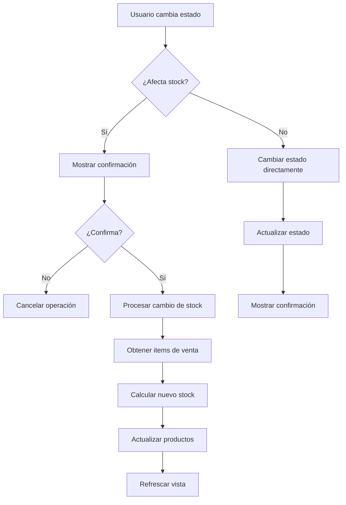

# 📦 Gestión Automática de Stock por Estados de Venta

## 🎯 Funcionalidad Implementada

Se ha implementado un sistema inteligente que **gestiona automáticamente el stock** cuando se cambian los estados de las ventas, garantizando consistencia entre el inventario y las transacciones.

## 🔄 Lógica de Stock por Estados

### **📊 Estados y su Impacto en Stock:**

| Estado | Descripción | Stock |
|--------|-------------|-------|
| **🟡 PENDIENTE** | Pedido registrado, stock NO descontado | **Sin afectar** |
| **🟢 COMPLETADO** | Venta confirmada, stock descontado | **Descontado** |
| **🔴 CANCELADO** | Venta anulada, stock NO afectado | **Sin afectar** |

### **⚡ Cambios de Estado y Acciones Automáticas:**

#### **🟡 → 🟢 (Pendiente → Completado)**
- ✅ **Acción**: Descuenta stock automáticamente
- ✅ **Confirmación**: Solicita confirmación antes del cambio
- ✅ **Log**: `📦 Descontando X de ProductoY (stock: 10 -> 7)`

#### **🔴 → 🟢 (Cancelado → Completado)**  
- ✅ **Acción**: Descuenta stock automáticamente
- ✅ **Confirmación**: Solicita confirmación antes del cambio

#### **🟢 → 🟡 (Completado → Pendiente)**
- ✅ **Acción**: Restaura stock automáticamente
- ✅ **Confirmación**: Solicita confirmación antes del cambio
- ✅ **Log**: `📦 Restaurando X a ProductoY (stock: 7 -> 10)`

#### **🟢 → 🔴 (Completado → Cancelado)**
- ✅ **Acción**: Restaura stock automáticamente  
- ✅ **Confirmación**: Solicita confirmación antes del cambio

## 🔧 Implementación Técnica

### **📁 Archivos Modificados:**

#### **1. `src/services/firebaseAdminService.ts`**
```typescript
export const updateSaleStatus = async (
  saleId: string, 
  newStatus: 'completed' | 'pending' | 'cancelled',
  currentStatus: 'completed' | 'pending' | 'cancelled'
): Promise<{ needsStockUpdate: boolean; saleItems?: SaleItem[] }> => {
  // Determinar si necesita actualización de stock
  const shouldDeductStock = (currentStatus === 'pending' || currentStatus === 'cancelled') && newStatus === 'completed';
  const shouldRestoreStock = currentStatus === 'completed' && (newStatus === 'pending' || newStatus === 'cancelled');
  
  // Obtener items de la venta si es necesario
  if (shouldDeductStock || shouldRestoreStock) {
    // Cargar items de la subcolección
    const itemsRef = collection(saleDocRef, 'items');
    const itemsSnapshot = await getDocs(itemsRef);
    // ... procesar items
  }
  
  return {
    needsStockUpdate: shouldDeductStock || shouldRestoreStock,
    saleItems: shouldDeductStock || shouldRestoreStock ? saleItems : undefined
  };
}
```

#### **2. `src/data/api.ts`**
```typescript
export const updateSaleStatusAPI = async (
  saleId: string, 
  newStatus: 'completed' | 'pending' | 'cancelled',
  currentStatus: 'completed' | 'pending' | 'cancelled'
) => {
  const result = await updateSaleStatus(saleId, newStatus, currentStatus);
  
  return {
    needsStockUpdate: result.needsStockUpdate,
    saleItems: result.saleItems,
    shouldDeductStock: (currentStatus === 'pending' || currentStatus === 'cancelled') && newStatus === 'completed',
    shouldRestoreStock: currentStatus === 'completed' && (newStatus === 'pending' || newStatus === 'cancelled')
  };
}
```

#### **3. `src/components/SalesHistory.tsx`**
```typescript
const updateSaleStatus = async (saleId: string, newStatus: string) => {
  const currentSale = sales.find(sale => sale.id === saleId);
  const currentStatus = currentSale.status;
  
  // Confirmar si afecta stock
  const willAffectStock = /* lógica de detección */;
  
  if (willAffectStock) {
    const confirmed = window.confirm(
      `⚠️ Esto ${action} el stock de los productos automáticamente.`
    );
    if (!confirmed) return;
  }
  
  // Procesar cambio de stock
  if (result.needsStockUpdate && result.saleItems) {
    const stockPromises = result.saleItems.map(async (item) => {
      const currentStock = await getCurrentProductStock(item.productId);
      let newStock: number;
      
      if (result.shouldDeductStock) {
        newStock = Math.max(0, currentStock - item.quantity);
      } else {
        newStock = currentStock + item.quantity;
      }
      
      await updateProductStockAction(item.productId, newStock);
    });
    
    await Promise.all(stockPromises);
  }
}
```

## 🎨 Experiencia de Usuario

### **👨‍💼 Para Administradores:**

#### **🔔 Confirmaciones Inteligentes:**
```
¿Confirmar cambio de estado a "COMPLETADO"?

⚠️ Esto DESCONTARÁ el stock de los productos automáticamente.

[Cancelar] [Confirmar]
```

#### **📱 Feedback Visual:**
- **🔄 Loading spinner** durante el procesamiento
- **✅ Toast de confirmación** con detalles del cambio
- **📊 Stock actualizado** en tiempo real

#### **📝 Mensajes Informativos:**
- `✅ Estado actualizado y stock descontado correctamente`
- `✅ Estado actualizado y stock restaurado correctamente`
- `❌ Error al actualizar el estado de la venta`

### **🔍 Casos de Uso Comunes:**

#### **📱 Pedido por WhatsApp:**
1. Cliente hace pedido → Estado: **PENDIENTE** (stock intacto)
2. Admin confirma pedido → Cambia a **COMPLETADO** (stock descontado)
3. Si hay problema → Cambia a **CANCELADO** (stock restaurado)

#### **🏪 Venta Directa:**
1. Venta en panel admin → Estado: **COMPLETADO** (stock ya descontado)
2. Si hay devolución → Cambia a **CANCELADO** (stock restaurado)

## 🔄 Flujo de Datos



## 🛡️ Validaciones y Seguridad

### **✅ Validaciones Implementadas:**
- **Stock mínimo**: No permite stock negativo (usa `Math.max(0, newStock)`)
- **Producto existente**: Verifica que el producto exista antes de actualizar
- **Confirmación obligatoria**: Para cambios que afecten stock
- **Manejo de errores**: Rollback en caso de fallo

### **🔒 Casos Edge Manejados:**
- **Producto eliminado**: Log de advertencia, continúa con otros
- **Stock insuficiente**: Establece stock en 0
- **Venta sin items**: Omite actualización de stock
- **Error de red**: Muestra error, no cambia estado local

## 📊 Logs y Monitoreo

### **🖥️ Logs de Consola:**
```javascript
📦 Descontando 2.5 de Asado de Tira (stock: 10 -> 7.5)
📦 Restaurando 1.0 a Milanesas (stock: 5 -> 6)
✅ Sale status updated: sale_20241215_001 -> completed
⚠️ Product with ID xyz not found
```

### **📱 Notificaciones Usuario:**
- **Success**: Estado y stock actualizados
- **Warning**: Confirmaciones antes de cambios críticos  
- **Error**: Fallos en actualización con detalles

## 🚀 Beneficios del Sistema

### **🎯 Para el Negocio:**
- ✅ **Inventario preciso** en tiempo real
- ✅ **Consistencia** entre ventas y stock
- ✅ **Trazabilidad completa** de cambios
- ✅ **Prevención de sobreventa**

### **👥 Para Usuarios:**
- ✅ **Proceso intuitivo** con confirmaciones claras
- ✅ **Feedback inmediato** de acciones
- ✅ **Prevención de errores** con validaciones
- ✅ **Transparencia total** en operaciones

---

## ✅ **SISTEMA COMPLETAMENTE FUNCIONAL**

El sistema ahora maneja automáticamente el stock basado en los estados de venta, proporcionando:
- **🔄 Gestión automática** de inventario
- **🛡️ Validaciones robustas** 
- **📱 UX intuitiva** con confirmaciones
- **📊 Trazabilidad completa** de cambios

¡Todo listo para un control total del inventario! 🎊